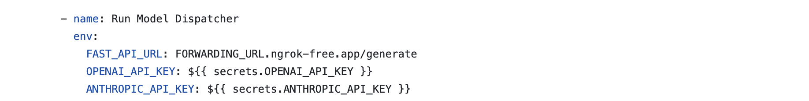

# PRISM(Pull Request Impact and Scoring Metrics)

PRISM is an In-built tool that analyzes and score the pull request created using large language models(LLMs). 

# Setup

## 1. clone the repository(terminal 1):
    https://github.com/The-Cloud-Lab/PRISM.git
    
 

## 2. Enable read and write permissions to the repository.
 Go to Repository -> settings -> Actions -> General -> WorkFlow permissions -> Select Read and write permissions.
    
 

## 3. Connecting LLMs
   ### Using LLMs locally
  
   #### 1. Ollama
Download and install ollama application: https://github.com/ollama/ollama

 

   #### 2. Ngrok and Uvicorn
   
**Ngrok:** Download and install https://dashboard.ngrok.com/get-started/setup
   
Get a new Authorization token and paste the following command in the local terminal_1 for the configuration.

    ngrok config add-authtoken $YOUR_AUTHTOKEN
    

**Uvicorn:** Download and install https://www.uvicorn.org/

Download the "ollama_api.py" file from the repository and place it in the terminal directory. 

 

   #### 3. Connecting Github workflow with local system using Ngrok and Uvicorn:
   #####  Step 1:
     
   Create two seperate terminals and use the following commands in respective terminals

   terminal 2:

    uvicorn ollama_api:app --host 0.0.0.0 --port 8000 
    
   terminal 3:
   
    ngrok http 8000
   
   #####   Step 2:
     
   Copy and paste the ngrok **Forwarding URL** into ".github/workflows/automate_pr_msg.yml" env section. 
   

        
 

  ### Using LLMs using API endpoints**
      
  
   
## 4. set up Firebase (Database)
Create a new project and use the Realtime databse using the following link:
    https://console.firebase.google.com

copy the firebase url: __https://unique_url.firebaseio.com/__ and go to Repository -> settings --> Security --> Secrets and variables --> Actions 
and paste it in Repoitory secrets with Name: FIREBASE_URL and Secret: {firebase url}. 
   
 

## 5. use the first terminal to install the application: 
   
 

## 6. Build and deployment Appliation using Github pages

   Go to 
    
 
   
## 7. PR Scores GitHub Extension

This browser extension adds a **PR Scores** tab to the top of any GitHub repository (next to Pull requests).

1. Clone this repo
2. Go to `chrome://extensions` and enable **Developer Mode**
3. Click **Load Unpacked**
4. Select the `pr-scores-extension/` folder
5. you'll see a **PR Scores** tab in your repository.

It links to the https://{username}.github.io/PRISM
